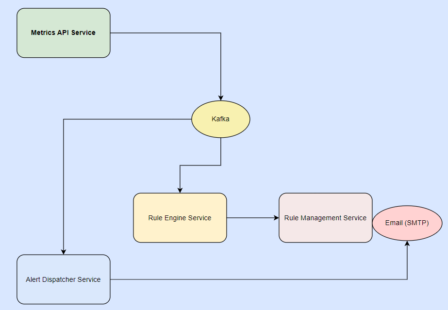

# Incident Alert System

## Overview

The **Incident Alert System** is a robust microservice-based application designed to detect and alert based on predefined metrics and logs. It leverages cutting-edge technologies like Go, Kafka, and Kubernetes to provide a scalable and reliable solution for monitoring and alerting.

## Architecture

The system is composed of four microservices, each with distinct responsibilities. These microservices communicate via REST APIs and Kafka to ensure seamless data flow and alert processing.



### Components:

1. **metrics-api-service** (Port: 8001):

   - Collects and processes metrics/log data.
   - Publishes data to Kafka for further processing.

2. **rule-engine-service** (Port: 8003):

   - Consumes metrics from Kafka.
   - Evaluates the metrics against predefined rules.
   - Triggers alerts when rules are violated.

3. **alert-dispatcher-service** (Port: 8002):

   - Receives alerts from the rule-engine-service.
   - Dispatches alerts via email or other notification channels.

4. **rule-management-service** (Port: 8004):
   - Provides a REST API for managing rules.
   - Allows users to define, update, and delete rules dynamically.

## Key Features

- **Microservice Architecture**: Ensures scalability, maintainability, and flexibility.
- **Kafka Integration**: Facilitates asynchronous communication and real-time data processing.
- **Customizable Rules**: Users can manage alerting rules dynamically through the rule-management-service.
- **Kubernetes Deployment**: All services are containerized and orchestrated using Kubernetes for high availability and scalability.
- **Docker Compose Support**: Simplified local setup using Docker Compose to build and run all services.

## Tech Stack

- **Programming Language**: Go
- **Message Broker**: Kafka
- **Container Orchestration**: Kubernetes
- **Containerization**: Docker

## Setup Instructions

### Prerequisites

- Kubernetes Cluster
- Kafka Cluster
- Docker
- Go (for local development)

### Deployment

#### Using Docker Compose

1. Clone the repository:

   ```bash
   git clone <repository-url>
   cd go-alert-system
   ```

2. Use Docker Compose to build and start all services:

   ```bash
   docker-compose up --build
   ```

3. Verify that all services are running:
   ```bash
   docker ps
   ```

#### Using Kubernetes

1. Build the Docker images for all services:

   ```bash
   docker build -t metrics-api-service ./metrics-api-service
   docker build -t rule-engine-service ./rule-engine-service
   docker build -t alert-dispatcher-service ./alert-dispatcher-service
   docker build -t rule-management-service ./rule-management-service
   ```

2. Deploy the application to Kubernetes using separate files for deployments and services:

   ```bash
   kubectl apply -f deployments/metrics-api-deployment.yaml
   kubectl apply -f deployments/rule-engine-api-deployment.yaml
   kubectl apply -f deployments/alert-dispatcher-api-deployment.yaml
   kubectl apply -f deployments/rule-management-api-deployment.yaml
   kubectl apply -f deployments/kafka-deployment.yaml
   kubectl apply -f deployments/zookeeper-deployment.yaml
   ```

3. Verify the deployment:
   ```bash
   kubectl get pods
   kubectl get services
   ```

### Local Development

1. Start Kafka and Zookeeper locally or use a cloud provider.
2. Run each service locally:
   ```bash
   go run ./metrics-api-service/main.go
   go run ./rule-engine-service/main.go
   go run ./alert-dispatcher-service/main.go
   go run ./rule-management-service/main.go
   ```

## API Endpoints

### Rule Management Service

- **GET** `/api/rules`: Retrieve all rules.
- **GET** `/api/rules/:id`: Retrieve a specific rule by ID.
- **POST** `/api/rules`: Create a new rule.
- **PUT** `/api/rules/:id`: Update an existing rule by ID.
- **DELETE** `/api/rules/:id`: Delete a rule by ID.

### Metrics API Service

- **POST** `/api/metrics`: Send metrics data to the system for evaluation.
  Example Request:

  ```json
  {
    "metricName": "memory_usage",
    "value": 77,
    "timestamp": "2024-12-19T12:00:00Z"
  }
  ```

  This request will be processed by the `metrics-api-service` and passed through the `rule-engine-service` for evaluation based on predefined rules. If a rule is violated, an alert will be dispatched by the `alert-dispatcher-service`.

## Usage

1. **Define Rules**:
   Use the `rule-management-service` API to define alerting rules. Example:

   ```bash
   curl -X POST -H "Content-Type: application/json" \
        -d '{"metric": "cpu_usage", "threshold": 80, "operator": ">"}' \
        http://localhost:8004/api/rules
   ```

2. **Send Metrics**:
   Post metrics data to the `metrics-api-service`. Example:

   ```bash
   curl -X POST -H "Content-Type: application/json" \
        -d '{"metricName": "memory_usage", "value": 77, "timestamp": "2024-12-19T12:00:00Z"}' \
        http://localhost:8001/api/metrics
   ```

3. **Receive Alerts**:
   Alerts will be dispatched via email or other configured channels.

## Contributing

Contributions are welcome! Please fork the repository and submit a pull request for any feature additions or bug fixes.

## License

This project is licensed under the MIT License. See the `LICENSE` file for details.
